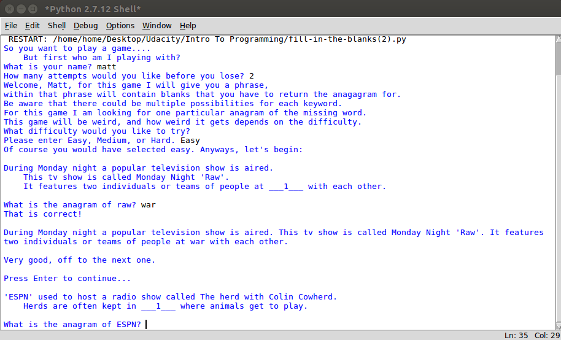

# Project: Anagram Game

For my project I created an Anagram game using Python. When the program is ran, the user is asked to fill in their name. I then use a while statement to check if the user entered in an actual name. To do this I used the isalpha function and the length function. The user is then prompted to fill in how many attempts they would like before they lose. After that the user is then asked to type in a difficulty of Easy, Medium, or Hard. 

I utilized a dictionary to contain each question with their corresponding anagram and solution. I also used an array to contain the blank spots. When the game begins a for loop retrieves the phrase and key word(s) from the dictionary. The user then types in a word, the `check_for_match` function is then triggered.  If the guess word matches the word in position the blank is then filled in and the rest of the statement is appended.

**Tools Used**

1. Python 2.7.12

**Running Code** 

1. Open up Python 2.7.12 Shell.

2. Within Python 2.7.12 Shell, click file open and then Navigate to the directory where fill-in-the-blanks.py resides.

3. Double click on fill-in-the-blanks.py to open up the module.

4. Within the module click run then run module.
